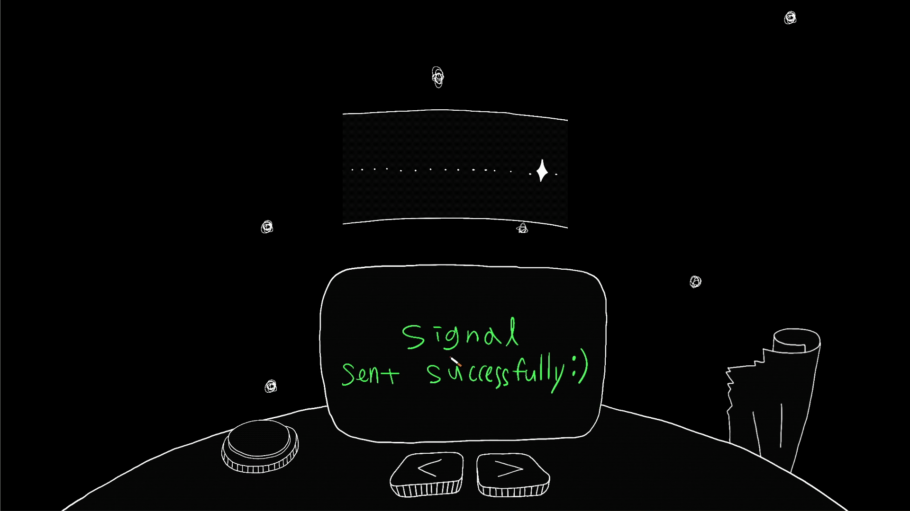

## Development Environment


## Abstract

[s.o.s](https://project-why.github.io/s.o.s/) is gamified social media.

- Explore empty space.
- Discover rescue messages, and decode the rescue message.
- Leave your own message in void space.



## Environment Settings

```bash
$ node -v
> v18.17.1

$ npm -v
> 9.6.7

$ npm install

$ npm run start
```
